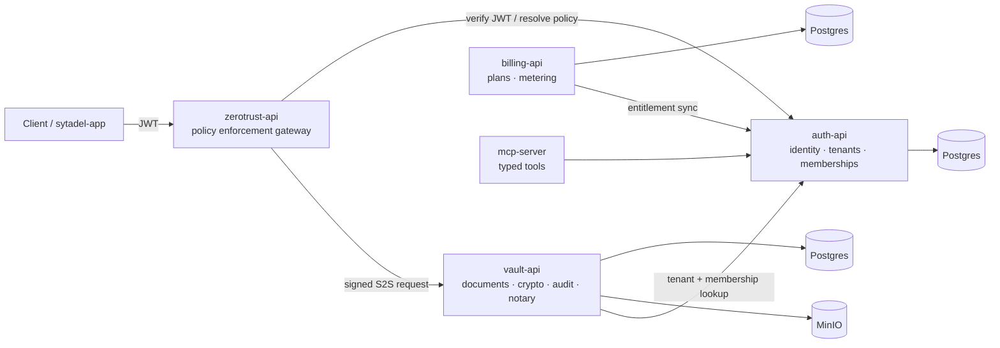

# Sytadel Suite

**A security-first, multi-tenant B2B platform that treats identity, access, document custody, audit integrity, and AI-assisted security operations as one system.**

Sytadel is a working reference stack for the problems that show up when a SaaS handles sensitive data: who can do what, across which tenant, with what proof — and how AI can help operate that safely without being handed the keys. It is built as independent services (each usable on its own) that compose into a suite.

> This is an engineering portfolio project, not a commercial product. It is designed to be **cloned, run, and read** — the code is the argument. Where something is a development default or still on the roadmap, this README says so explicitly.

---

## What it demonstrates

| Capability | What's actually there | Signal for |
|---|---|---|
| **Tamper-evident audit** | SHA-256 hash chain, append-only enforced at the DB (trigger + `REVOKE`), concurrency-safe (`pg_advisory_xact_lock`), and **anti-truncation checkpoints anchored with RFC 3161** timestamps | AppSec, compliance/GRC |
| **Document notarization** | Real **Merkle tree (RFC 6962)** batching + RFC 3161 trusted timestamps; honest `SIMULATED` fallback when no TSA is configured (never a fake proof) | Applied cryptography |
| **Encryption at rest** | AES-256-GCM **envelope encryption**, per-tenant data keys (DEK), random IV per operation | Cryptography, data protection |
| **Modern auth** | JWT with pinned algorithm, refresh-token rotation **with reuse detection**, WebAuthn/passkeys that are **user-enumeration-resistant** | IAM, Auth |
| **Policy enforcement gateway** | Per-request JWT validation, per-tenant authorization policy, **signed service-to-service calls** to the vault | Platform security |
| **AI security layer** | LLM **as a policy compiler** (NL → RBAC), AI access review, session-anomaly classification — all with **evals** (precision/recall, cost, latency) | AI Engineering, AI+Security |
| **MCP + agentic HITL** | An MCP server exposing typed tools over the identity plane, and a LangGraph agent that **proposes** access decisions a human **applies** | Agentic systems, Anthropic ecosystem |

A deep technical/security self-review of this suite lives at [`docs/reports/sytadel-portfolio-review-2026-09.md`](./docs/reports/sytadel-portfolio-review-2026-09.md), including known issues and their status.

---

## Architecture

Every request is authenticated at the edge, authorized against per-tenant policy, and only reaches the vault as a **signed** service-to-service call. `auth-api` is the single source of truth for tenants and memberships; the vault holds documents and never mints identities.



**Request flow**

1. `auth-api` authenticates the user and issues a tenant-scoped JWT.
2. `zerotrust-api` validates the token, evaluates per-tenant authorization policy, and signs the downstream request.
3. `vault-api` accepts **only** requests signed by the gateway, then enforces membership/RBAC before touching data.
4. `vault-api` resolves tenants and memberships from `auth-api` (no cross-service foreign keys).

> **On the "Zero Trust" name:** the posture here is *no service trusts an unauthenticated or unsigned request* — identity is re-derived from a verified JWT at the gateway and carried into a signed canonical request. It is **service-to-service policy enforcement**, not a full BeyondCorp device-posture model. The name reflects the enforcement stance, not a claim of the complete ZT maturity model.

---

## Repository layout

This is a meta-repo; each service is a public submodule.

| Path | Service | Role |
|---|---|---|
| `auth/auth-api` | **auth-api** (NestJS) | Identity, tenants, memberships, sessions, passkeys, secret rotation, AI access review, agentic access requests |
| `ZeroTrust/zerotrust-api` | **zerotrust-api** (NestJS) | JWT validation, per-tenant policy engine, NL→RBAC generator, signed downstream calls |
| `securechain-vault` | **vault-api** (NestJS) | Documents, envelope encryption, tamper-evident audit, Merkle/RFC 3161 notary |
| `billing/billing-api` | **billing-api** (NestJS) | Plans, subscriptions, metering, entitlement sync |
| `mcp-server` | **sytadel-mcp-server** (TS) | MCP server exposing typed tools over the identity plane |
| `sytadel-web` | Landing (Astro) | Marketing site + product narrative |
| `sytadel-app` | Dashboard (Next.js) | Operational console for Auth + Vault + Billing |

```bash
git clone --recurse-submodules <repo-url>
# or, if already cloned:
git submodule update --init --recursive
```

---

## Quick start

Requires Docker + Docker Compose.

```bash
docker compose up --build
```

| Service | URL |
|---|---|
| auth-api | http://localhost:3002/api |
| vault-api | http://localhost:3000 |
| zerotrust-api | http://localhost:3010 |
| billing-api | http://localhost:3020/api |
| sytadel-web | http://localhost:4321 |
| sytadel-app | http://localhost:3003 |
| MinIO console | http://localhost:9001 |

Tear down (add `-v` to drop volumes):

```bash
docker compose down
```

### Try the main flow

With `AUTH_BOOTSTRAP_DEMO_DATA=true`, `auth-api` seeds a **local-only** demo tenant and user (see [Demo credentials](#demo-credentials)).

```bash
# 1. Log in against auth-api
curl -X POST http://localhost:3002/api/auth/login \
  -H 'Content-Type: application/json' \
  -d '{"email":"admin@test.com","password":"123456","tenantSlug":"sentinel-labs"}'

# 2. Use the accessToken through the Zero Trust gateway
curl http://localhost:3010/vault/tenants -H "Authorization: Bearer <ACCESS_TOKEN>"
# GET  /vault/tenants -> 200
# POST /vault/tenants -> 409  (tenant creation is owned by auth-api, not the vault)
```

### Smoke tests

```bash
./scripts/smoke.sh          # auth -> zerotrust -> vault, incl. a negative-case (409) assertion
./scripts/notary-smoke.sh   # notary flow via vault-api
node scripts/validate-metering.js
```

---

## Security model

Sytadel's guiding rule: *the MVP may be incomplete, but it must not violate tenant isolation, access control, document integrity, or auditability.*

### Implemented

- **Tenant isolation** enforced server-side from the verified token/membership — data queries are scoped by `tenantId`, never by client-supplied input.
- **JWT**: algorithm pinned (no `alg:none`/confusion), issuer/audience/expiry checked, separate access/refresh secrets, refresh rotation with **reuse detection** (revokes the token family).
- **WebAuthn/passkeys**: constant-shape `authenticationBegin` (no `allowCredentials` leak), challenge stored even for unknown users, timing floor — **resistant to account enumeration**; signature-counter clone detection.
- **Signed service-to-service calls** gateway → vault over a canonical request (method, path, body hash, identity, timestamp, nonce), with **persistent anti-replay** (atomic `INSERT … ON CONFLICT` in Postgres).
- **Tamper-evident audit chain** + **RFC 3161-anchored checkpoints** that detect suffix-truncation and divergence.
- **Envelope encryption** (AES-256-GCM, per-tenant DEK, random IV per op).
- **HTTP hardening**: `helmet` + per-IP rate limiting on all four APIs; CSP on the frontends (nonce-per-request on the dashboard).
- **Secret rotation** for service-account credentials with a 24h overlap/grace window.

### Development defaults (local/CI only — not for production)

- Demo credentials and bootstrap data (behind `AUTH_BOOTSTRAP_DEMO_DATA`).
- Local Postgres/MinIO use throwaway credentials.
- Some inter-service secrets ship with `dev-insecure-*` / `change_me_*` defaults in `docker-compose.yml`. See [Secrets & production](#secrets--production) — hardening these to a single required-in-prod form is tracked in the review report.

### Roadmap / in progress

- **Asymmetric request signing (Ed25519)** to replace the shared HMAC between gateway and vault — implemented and being rolled out; **HMAC is still the runtime default**.
- Per-tenant Zero Trust policy administration UX.
- Notary and audit extracted into standalone services.

---

## AI layer

The AI features are built to a simple principle: **the model advises and compiles; deterministic code decides and enforces.**

- **NL → RBAC policy generator** (`zerotrust-api`): Claude emits a structured `PolicySet` (JSON Schema output) that a **deterministic evaluator** runs at request time. The model never decides access directly.
- **AI-driven access review** (`auth-api`): builds a real snapshot (users, service accounts, passkeys, sessions, anomalies) and produces enum-typed recommendations.
- **Session-anomaly classification** (`auth-api`): heuristic scoring (IP/country/UA) plus LLM classification — currently **advisory** (surfaced/logged, not auto-blocking).
- **MCP server**: five typed tools over the identity plane; the tenant is always derived from the authenticated principal, never from a model-supplied argument.
- **Agentic access approval (HITL)**: a LangGraph agent **proposes** allow/deny with reasoning; a human OWNER/ADMIN **applies** the membership. The agent has no write path, and the flow fails closed if the model is unavailable.

Every AI feature ships with **evals** (labeled fixtures reporting precision/recall, cost per call, and p50/p95 latency) — because an LLM feature without evals is a toy. Numbers and methodology are in the per-service docs and the roadmap.

**Model:** Claude (Anthropic SDK) with structured output. `ANTHROPIC_API_KEY` is read from the environment; no key is committed.

---

## Secrets & production

Shared secrets are injected via environment variables. `docker-compose.yml` interpolates them from a root `.env` (auto-loaded, gitignored); without one, the stack falls back to explicit `dev-insecure-*` defaults **suitable only for local/CI**.

Generate strong values for any real environment:

```bash
cat > .env <<EOF
JWT_ACCESS_SECRET=$(openssl rand -hex 32)
AUTH_JWT_REFRESH_SECRET=$(openssl rand -hex 32)
INTERNAL_SERVICE_SECRET=$(openssl rand -hex 32)
INTERNAL_HMAC_SECRET=$(openssl rand -hex 32)
BILLING_INTERNAL_SERVICE_SECRET=$(openssl rand -hex 32)
BILLING_INTERNAL_HMAC_SECRET=$(openssl rand -hex 32)
EOF
```

**Production overlay (fail-closed):** `docker-compose.prod.yml` removes the dev defaults for the shared JWT/internal secrets and requires each one — Compose fails before start if any is missing:

```bash
docker compose -f docker-compose.yml -f docker-compose.prod.yml up -d
```

> **Known gap (tracked):** a few dev credentials — notably `ZT_HMAC_SECRET`, the vault `MASTER_KEY_B64`, and the local DB/MinIO creds — are still hardcoded in `docker-compose.yml` and not yet covered by the prod overlay's required-secret gate. See the [review report](./docs/reports/sytadel-portfolio-review-2026-09.md) for the full list and the one-line fixes.

### Demo credentials

These are **local-only** seed data, not secrets, and exist purely so the stack is runnable out of the box:

| Field | Value |
|---|---|
| Tenant | `sentinel-labs` |
| User | `admin@test.com` |
| Password | `123456` |
| Role | `OWNER` |

They only exist when `AUTH_BOOTSTRAP_DEMO_DATA=true`. Do not enable demo bootstrap in any shared environment.

---

## Documentation

- **Roadmap** — [`docs/ROADMAP.md`](./docs/ROADMAP.md)
- **Architecture (master doc)** — [`docs/architecture/sytadel-master-es.md`](./docs/architecture/sytadel-master-es.md)
- **Security & portfolio review** — [`docs/reports/sytadel-portfolio-review-2026-09.md`](./docs/reports/sytadel-portfolio-review-2026-09.md)
- **Per-service** — [auth-api](./auth/auth-api/README.md) · [zerotrust-api](./ZeroTrust/zerotrust-api/README.md) · [vault-api](./securechain-vault/README.md) · [billing-api](./billing/billing-api/) · [sytadel-app](./sytadel-app/README.md) · [sytadel-web](./sytadel-web/README.md)

> Most in-repo documentation is written in Spanish; this README is in English for the primary audience. If you'd like any service doc translated, open an issue.
